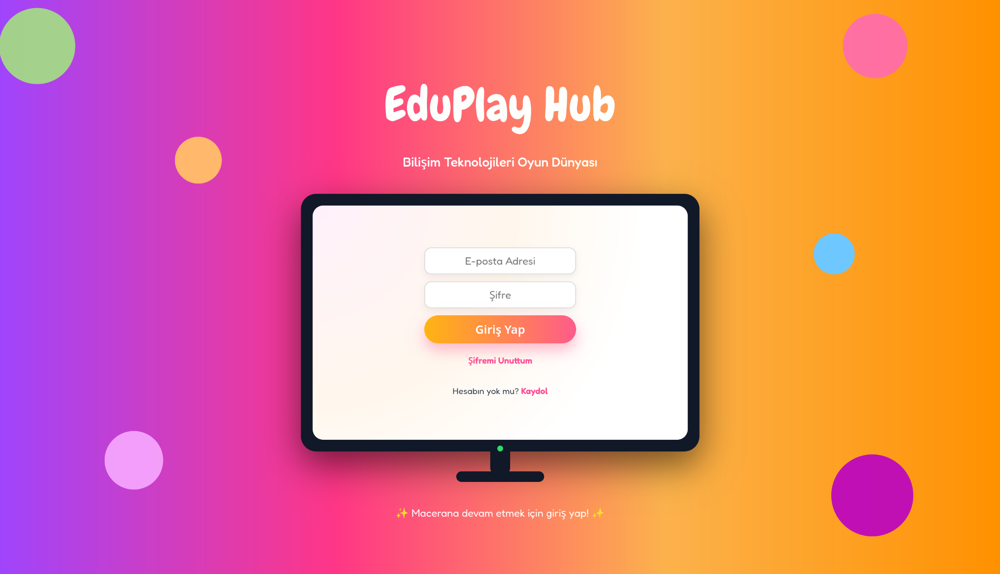
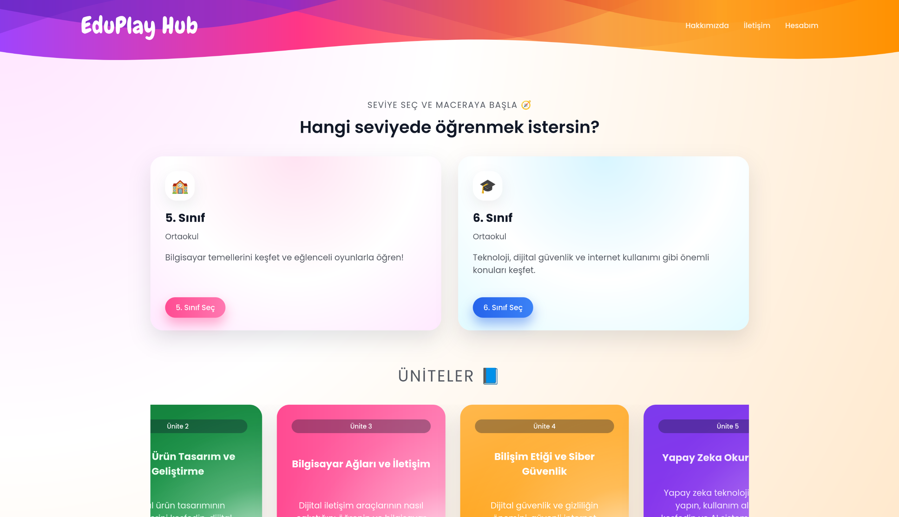
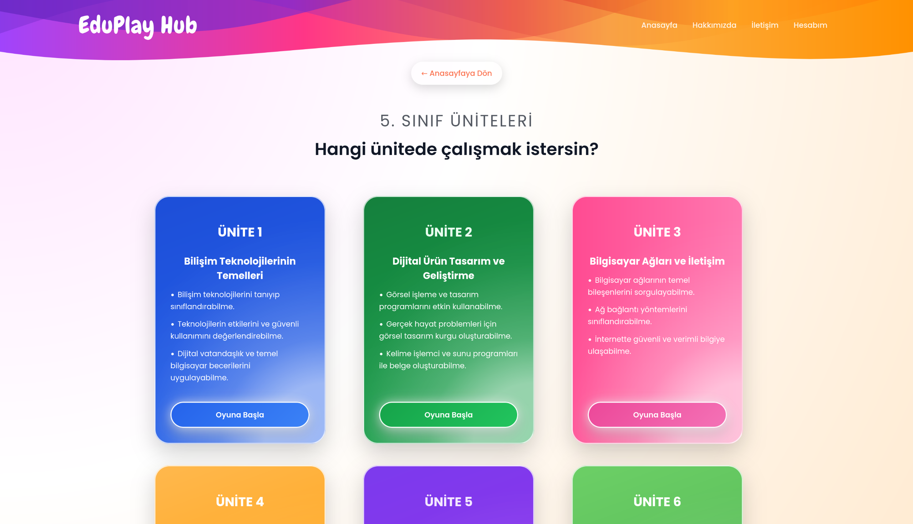
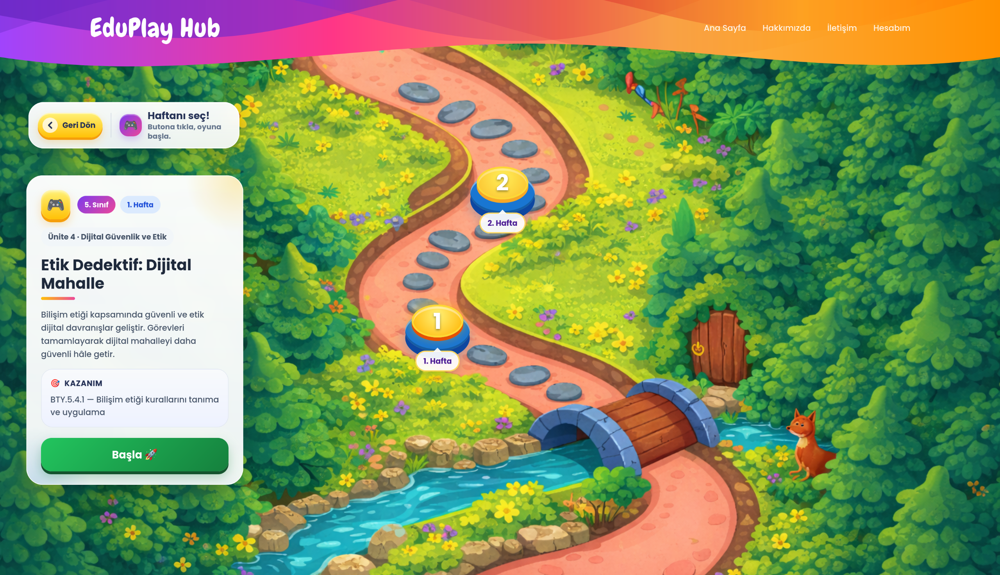
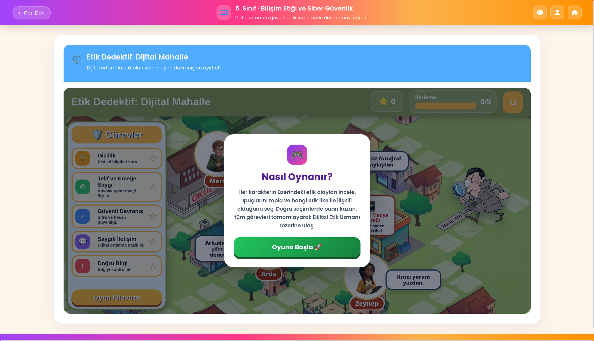

# EduPlay Hub

> **A gamified assessment platform for evaluating 5th and 6th grade students' Information Technologies knowledge through interactive games.**

## 🎯 About the Project

EduPlay Hub is a web-based assessment platform that combines **gamification and interactive educational games** to make the assessment process more engaging for students.

The platform provides separate experiences for **students and teachers**. Students complete game-based assessment activities, while teachers can monitor their progress and assessment results.

## ✨ Key Features

* 🎮 Game-based assessment activities
* 👨‍🎓 Student and teacher roles
* 🔐 Role-based authentication and authorization
* 📊 Student progress tracking
* 🗂️ Structured **Grade → Unit → Week → Game** assessment flow
* 🗺️ Unit-based interactive assessment map
* 👩‍🏫 Teacher dashboard
* 🔄 Real-time progress tracking


## 🛠️ Tech Stack

| Layer          | Technologies            |
| -------------- | ----------------------- |
| **Backend**    | Python, Flask           |
| **Database**   | PostgreSQL, Supabase    |
| **Frontend**   | JavaScript, HTML5, CSS3 |
| **Deployment** | Render                  |

## 🏗️ System Architecture

```text
┌─────────────────────┐
│      Frontend       │
│ JavaScript / HTML5  │
│       / CSS3        │
└──────────┬──────────┘
           │
           ▼
┌─────────────────────┐
│     Flask API       │
│   Python Backend    │
└──────────┬──────────┘
           │
           ▼
┌─────────────────────┐
│     PostgreSQL      │
│       Supabase      │
└─────────────────────┘
```
## 📸 Screenshots

### Login Screen



### Home Page



### Unit Selection



### Assessment Map



### Game Interface



### 👩‍💻 My Contributions

As the Lead Full-Stack Developer, I was responsible for:

- Designed and developed the backend using Python and Flask
- Designed the relational database schema using PostgreSQL/Supabase
- Developed Flask routes for role-based rendering and data persistence
- Implemented authentication and role-based authorization
- Integrated educational games into the platform
- Developed student progress tracking functionality
- Contributed to production deployment

## 📊 Project Highlights

* **24** interactive educational games
* **2** user roles: Student & Teacher
* **Python / Flask** backend
* **PostgreSQL** relational database
* Production deployment with **Render**

## 👥 Team

EduPlay Hub was developed as a team graduation project.

* **Aybüke Kuruyüz**
* **Tuğba Kayıhan** 
* **Cemre Ece Beyazgül**
* **Elif Bensu Koral**


## 📌 Project Status

**Graduation Project — 2026**

EduPlay Hub was developed as a university graduation project and is currently being further improved.

> **Note:** The source code is private. This repository provides an overview of the project's features, architecture, technologies, screenshots, and team contributions.
